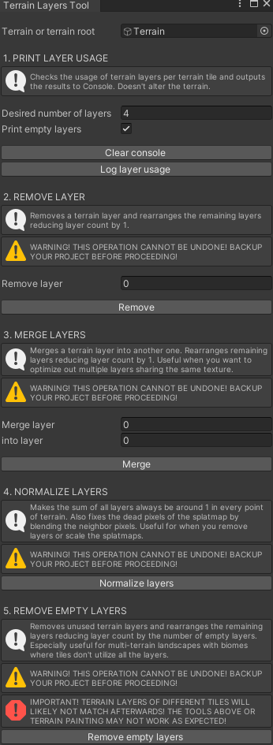

# Terrain Layers Tool

Set of Unity Editor tools that allow you to deal with terrain layers (count, remove, merge, normalize, automatically remove unused). Useful for optimization, especially for tiled terrains.

**WARNING: the operations cannot be undone! Backup your project first!**

## Installation

- Option 1: via Package Manager, press the + button and select `Add package from git URL..`, then paste `https://github.com/marked-one/TerrainLayersTool.git`. Or use the format `https://github.com/marked-one/TerrainLayersTool.git#1.0.0` to target a particular version (1.0.0 in this case).

- Option 2: clone or download this repository. Via Package Manager, press the + button and select `Add package from disk..`. Then target the `package.json` manifest.

- Option 3: clone or download this repository and move the folder to `<your Unity project>/Packages` folder.

## License

[MIT License](../LICENSE.md)
