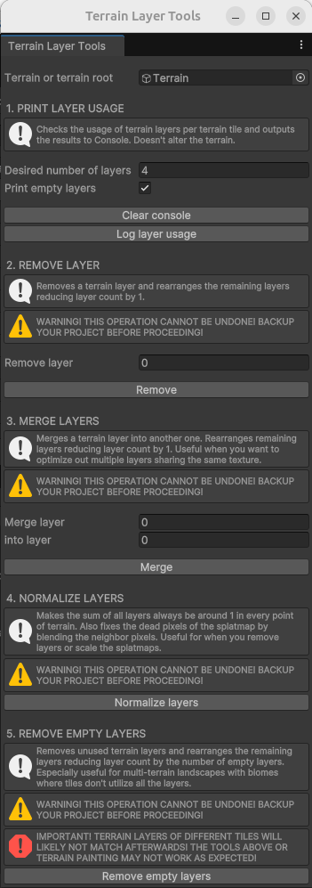

# Terrain Layer Tools for Unity

Set of Unity Editor tools that allow you to deal with terrain layers (count, remove, merge, automatically remove unused). Useful for optimization, especially for tiled terrains.

**WARNING: most operations cannot be undone! Backup your project first!**




## Installation

- Option 1: via Package Manager, press the `+` button and select `Add package from git URL...`, then paste `https://github.com/vklubkov/UnityTerrainLayerTools.git`. Or use the format `https://github.com/vklubkov/UnityTerrainLayerTools.git#1.1.0` to target particular package version.


- Option 2: clone or download this repository. Via Package Manager, press the `+` button and select `Add package from disk..`. Then target the `package.json` manifest.


- Option 3: clone or download this repository and move the folder to `<your Unity project>/Packages` folder.


- Option 4: simply copy the `TerrainLayerToolsWindow.cs` file into your project, ideally place it in the `Editor` folder.


## License

[MIT License](LICENSE.md)

```
MIT License

Copyright (c) 2023, 2025 Vladimir Klubkov

Permission is hereby granted, free of charge, to any person obtaining a copy
of this software and associated documentation files (the "Software"), to deal
in the Software without restriction, including without limitation the rights
to use, copy, modify, merge, publish, distribute, sublicense, and/or sell
copies of the Software, and to permit persons to whom the Software is
furnished to do so, subject to the following conditions:

The above copyright notice and this permission notice shall be included in all
copies or substantial portions of the Software.

THE SOFTWARE IS PROVIDED "AS IS", WITHOUT WARRANTY OF ANY KIND, EXPRESS OR
IMPLIED, INCLUDING BUT NOT LIMITED TO THE WARRANTIES OF MERCHANTABILITY,
FITNESS FOR A PARTICULAR PURPOSE AND NONINFRINGEMENT. IN NO EVENT SHALL THE
AUTHORS OR COPYRIGHT HOLDERS BE LIABLE FOR ANY CLAIM, DAMAGES OR OTHER
LIABILITY, WHETHER IN AN ACTION OF CONTRACT, TORT OR OTHERWISE, ARISING FROM,
OUT OF OR IN CONNECTION WITH THE SOFTWARE OR THE USE OR OTHER DEALINGS IN THE
SOFTWARE.
```